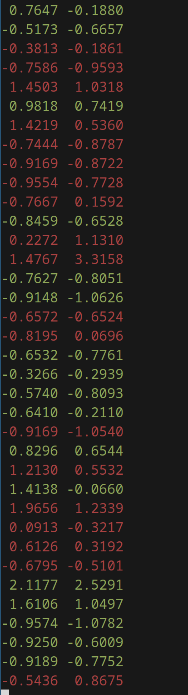

# viewer
A tool for displaying bins in the terminal
```
usage: viwer <path/bins/file.bin> [offset]

```
```
shortcuts:
    `l`     move forward
    `h`     move backward
    `G`     move to last bin
    `gg`    move to first bin
    `q`, ^C quit
```

out
</img>
